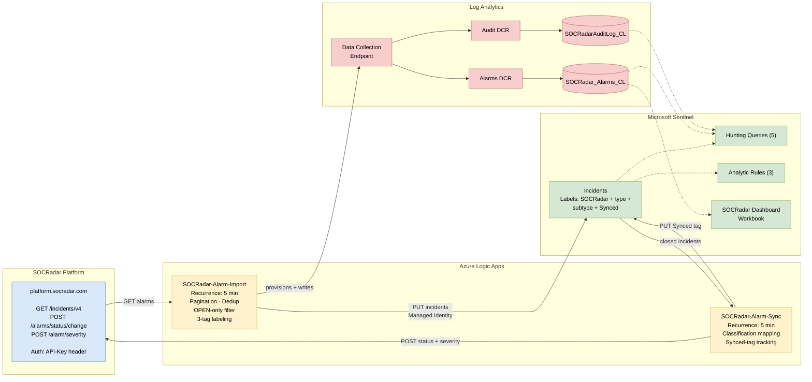

# ⚠️ SOCRadar

> ⚠️ **Unpublished:** This item is from a solution that is not yet published on Azure Marketplace or not installed in Content Hub.

**Browse:** [🏠](../README.md) · [Solutions](../solutions-index.md) · [Connectors](../connectors-index.md) · [Methods](../methods-index.md) · [Tables](../tables-index.md) · [Content](../content/content-index.md) · [Parsers](../parsers/parsers-index.md) · [ASIM Parsers](../asim/asim-index.md) · [ASIM Products](../asim/asim-products-index.md) · [📊](../statistics.md)

↑ [Back to Solutions Index](../solutions-index.md)

---

| Attribute | Value |
|:------------------------|:------|
| **Publisher** | SOCRadar |
| **Support Tier** | Partner |
| **Support Link** | [https://github.com/Radargoger/azure-one-click-documentations/blob/main/azureincidents.md](https://github.com/Radargoger/azure-one-click-documentations/blob/main/azureincidents.md) |
| **Categories** | domains |
| **Version** | 3.0.0 |
| **Author** | SOCRadar - integration@socradar.io |
| **First Published** | 2026-02-08 |
| **Last Updated** | 2026-04-19 |
| **Solution Folder** | [SOCRadar](https://github.com/Azure/Azure-Sentinel/blob/master/Solutions/SOCRadar) |

The [SOCRadar](https://socradar.io/) solution for Microsoft Sentinel provides bidirectional integration between SOCRadar XTI Platform and Microsoft Sentinel. Import alarms as incidents, sync closed incidents back to SOCRadar with classification mapping.

## Contents

- [Data Connectors](#data-connectors)
- [Tables Used](#tables-used)
- [Content Items](#content-items)
- [Additional Documentation](#additional-documentation)

## Data Connectors

**This solution does not include data connectors.**

This solution may contain other components such as analytics rules, workbooks, hunting queries, or playbooks.

## Tables Used

This solution queries **2 table(s)** from its content items:

| Table | Used By Content |
|-------|----------------|
| [`SOCRadarAuditLog_CL`](../tables/socradarauditlog-cl.md) | Hunting, Workbooks |
| [`SOCRadar_Alarms_CL`](../tables/socradar-alarms-cl.md) | Analytics, Hunting, Workbooks |

### Internal Tables

The following **1 table(s)** are used internally by this solution's content items:

| Table | Used By Content |
|-------|----------------|
| [`SecurityIncident`](../tables/securityincident.md) | Analytics, Hunting |

## Content Items

This solution includes **11 content item(s)**:

| Content Type | Count |
|:-------------|:------|
| Hunting Queries | 5 |
| Analytic Rules | 3 |
| Playbooks | 2 |
| Workbooks | 1 |

### Analytic Rules

| Name | Severity | Tactics | Tables Used |
|:-----|:---------|:--------|:------------|
| [SOCRadar Alarm Volume Spike](../content/socradar-socradar-alarm-volume-spike-4a7b3c9e-2d15-4e8f-b6a3-9c2e7d5a1b4f-7d7528ed.md) | Medium | Impact, Exfiltration | [`SOCRadar_Alarms_CL`](../tables/socradar-alarms-cl.md) |
| [SOCRadar High or Critical Severity Alarm](../content/socradar-socradar-high-or-critical-severity-alarm-8f3e2c5a-7b91-4d6a-9e8f-1c4a2b5d7e3f-1c14f887.md) | High | Reconnaissance, InitialAccess | [`SOCRadar_Alarms_CL`](../tables/socradar-alarms-cl.md) |
| [SOCRadar Unsynced Closed Incident](../content/socradar-socradar-unsynced-closed-incident-6e2f8d4b-5a71-4c9e-b3f6-8a1c9d4e7b2a-ea970a79.md) | Low | Discovery | *Internal use:* [`SecurityIncident`](../tables/securityincident.md) |

### Hunting Queries

| Name | Tactics | Tables Used |
|:-----|:--------|:------------|
| [SOCRadar Alarm Overview](../content/socradar-socradar-alarm-overview-12a3dfda-ab80-4664-aed9-7f6f9f3b4a23-99062102.md) | Discovery | [`SOCRadar_Alarms_CL`](../tables/socradar-alarms-cl.md) |
| [SOCRadar Alarm Trends](../content/socradar-socradar-alarm-trends-bbafd1c6-8da9-4de3-b100-6964dedd3f3e-63397f7c.md) | Discovery | [`SOCRadar_Alarms_CL`](../tables/socradar-alarms-cl.md) |
| [SOCRadar Audit Analysis](../content/socradar-socradar-audit-analysis-afae44e5-e2e2-4f0e-9535-2aeb3766a847-56ecb658.md) | Discovery | [`SOCRadarAuditLog_CL`](../tables/socradarauditlog-cl.md) |
| [SOCRadar Critical Alarms](../content/socradar-socradar-critical-alarms-ffa80945-44de-4900-bda5-9f1410c60166-08a0f8c2.md) | Impact | [`SOCRadar_Alarms_CL`](../tables/socradar-alarms-cl.md) |
| [SOCRadar Incident Correlation](../content/socradar-socradar-incident-correlation-3a665ce4-b824-4a79-861b-c9f80ab4daba-143cdc23.md) | Discovery | *Internal use:* [`SecurityIncident`](../tables/securityincident.md) |

### Workbooks

| Name | Tables Used |
|:-----|:------------|
| [SOCRadar-Dashboard](../content/socradar-socradar-dashboard-df56f072.md) | [`SOCRadarAuditLog_CL`](../tables/socradarauditlog-cl.md) [`SOCRadar_Alarms_CL`](../tables/socradar-alarms-cl.md) |

### Playbooks

| Name | Description | Tables Used |
|:-----|:------------|:------------|
| [SOCRadar-Alarm-Import](../content/socradar-socradar-alarm-import-08438e78.md) | Imports alarms from SOCRadar with optional audit logging and custom table storage. Supports all stat... | - |
| [SOCRadar-Alarm-Sync](../content/socradar-socradar-alarm-sync-1ffe3246.md) | Syncs closed incidents from Microsoft Sentinel back to SOCRadar platform. Uses Synced tag to prevent... | - |

## Additional Documentation

> 📄 *Source: [SOCRadar/README.md](https://github.com/Azure/Azure-Sentinel/blob/master/Solutions/SOCRadar/README.md)*

# SOCRadar Intelligence for Microsoft Sentinel

## Overview

The SOCRadar solution for Microsoft Sentinel provides bidirectional integration between SOCRadar XTI Platform and Microsoft Sentinel. Import SOCRadar alarms as Microsoft Sentinel incidents and sync closed incidents back to SOCRadar with classification mapping.

## Architecture

## Key Features

**Alarm Import**
- Automatically imports SOCRadar alarms as Microsoft Sentinel incidents
- Paginated fetching with duplicate prevention
- Severity and status mapping
- Tags for categorization (SOCRadar, alarm type, sub type)
- Optional closed alarm import with classification

**Bidirectional Sync**
- Closed incidents in Microsoft Sentinel update alarm status in SOCRadar
- Classification mapping: TruePositive to Resolved, FalsePositive to False Positive, BenignPositive to Mitigated

**Analytics**
- SOCRadar Dashboard workbook with severity, status, and timeline charts
- 5 hunting queries for alarm analysis and correlation
- Optional audit logging for operational monitoring

## Prerequisites

- Microsoft Sentinel workspace

*[Content truncated...]*

## Release Notes

| **Version** | **Date Modified (DD-MM-YYYY)** | **Change History** |
|-------------|--------------------------------|--------------------|
| 3.0.0       | 26-02-2026                     | Initial release.   |

---

**Browse:** [🏠](../README.md) · [Solutions](../solutions-index.md) · [Connectors](../connectors-index.md) · [Methods](../methods-index.md) · [Tables](../tables-index.md) · [Content](../content/content-index.md) · [Parsers](../parsers/parsers-index.md) · [ASIM Parsers](../asim/asim-index.md) · [ASIM Products](../asim/asim-products-index.md) · [📊](../statistics.md)

↑ [Back to Solutions Index](../solutions-index.md)

